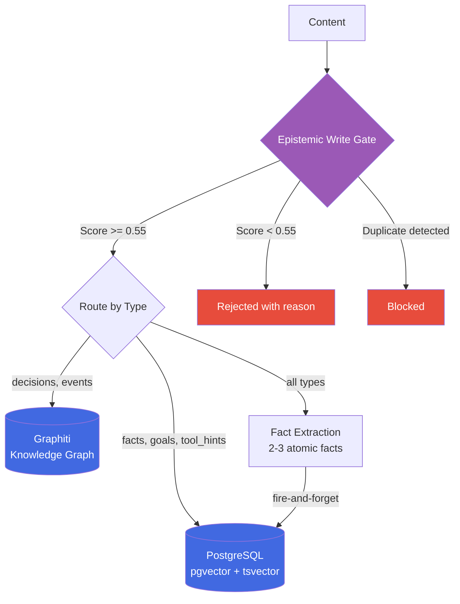
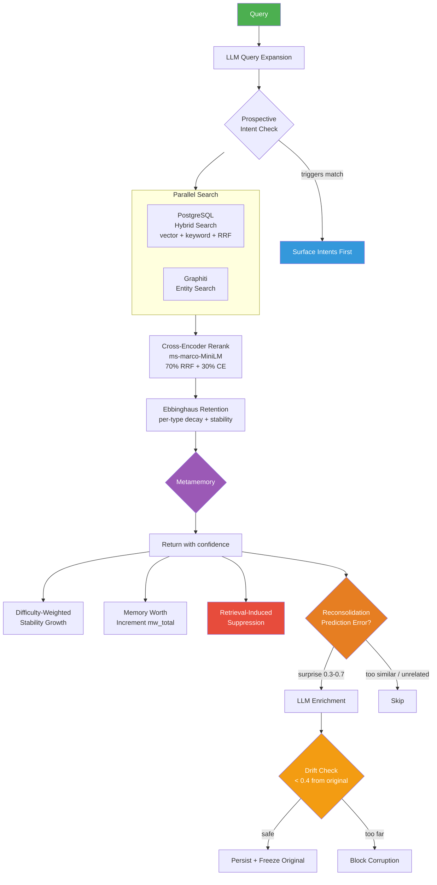
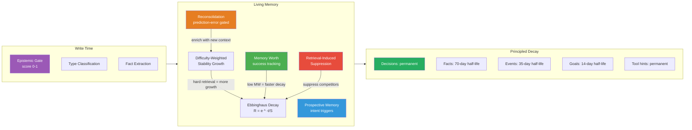

<p align="center">
  
  
  
  
</p>

# MemCore

**Memory that learns from how you use it.**

Every AI memory system today is a database you search. Store text, embed it, retrieve the closest match. MemCore is different — it's a living memory system modeled after how the human brain actually works. Memories strengthen when recalled. Hard retrievals build more durability than easy ones. Unused knowledge fades on a principled curve. The system tracks which memories actually help and which are noise. Competing memories get suppressed. Original content is frozen before enrichment to prevent drift. The system knows when it's confident and when it's guessing.

MemCore scores quality *before* writing (epistemic write gate), tracks *how* memories are used (difficulty-weighted stability from Bjork's Testing Effect), measures *whether they helped* (Memory Worth counters), tells the LLM *how much to trust* what it found (metamemory), forgets *what isn't needed* (per-type Ebbinghaus decay), enriches memories through use (prediction-error gated reconsolidation), defends against content drift (original content freeze), suppresses redundant competitors (retrieval-induced suppression from Wimber 2015), remembers things *for the future* (prospective memory), and surfaces relevant tools alongside memories (MCP tool hints).

<p align="center">
  
  <br>
  <em>Knowledge graph built automatically from memories — 2,314 entities, 5,484 relationships</em>
</p>

---

## What Makes MemCore Different

| Capability | MemCore | MemPalace | OMEGA | AgentMemory | Mem0 |
|-----------|---------|-----------|-------|-------------|------|
| **Write gate** (score before storing) | Epistemic scoring (0-1) | None | None | None | None |
| **Metamemory** (confidence on recall) | FOK-inspired levels | None | None | None | None |
| **Reconsolidation** (enrich on recall) | Prediction-error gated | None | None | None | None |
| **Prospective memory** (future intents) | Trigger conditions | None | None | None | None |
| **Difficulty-weighted stability** | Bjork's Testing Effect | None | None | None | None |
| **Memory Worth tracking** | Success/total counters | None | None | None | None |
| **Retrieval-induced suppression** | Wimber 2015 | None | None | None | None |
| **Content drift defense** | Original freeze + drift tracking | None | None | None | None |
| **Ebbinghaus decay** | Per-type lambdas, stability growth | None | Linear | Gaussian | None |
| **Cross-encoder reranking** | ms-marco-MiniLM, 70/30 blend | None | ms-marco | ms-marco | None |
| **Knowledge graph** | Graphiti (FalkorDB) | None | None | SQLite graph | None |
| **Multi-agent** | Namespaces, MCP, multi-device | Single | Single | Single | Cloud |
| **Tool hint injection** | Semantic MCP tool matching | None | None | None | None |

### Where We Stand (April 2026)

**90% end-to-end QA accuracy** on LongMemEval — the LLM must generate the correct answer, not just find the right document.

| System | LongMemEval | What It Actually Measures |
|--------|-------------|--------------------------|
| AgentMemory V4 | 96.2% QA | Best pure retrieval engine (6-signal fusion) |
| Chronos | 95.6% QA | Best temporal reasoning (SVO event calendar) |
| OMEGA | 95.4% QA | Best local-only system (SQLite + forgetting) |
| Mastra OM | 94.87% QA | Best no-retrieval approach (observation compression) |
| **MemCore** | **~90% QA** | **Only system with full bio-inspired lifecycle** |
| Mem0 | ~49% QA | Cloud-hosted vector search |

**Our thesis**: The storage and retrieval problem is largely solved. The remaining frontier is **memory lifecycle** — what to store, when to forget, how memories evolve, how to know what you don't know, and which memories actually help.

---

## Quick Start

### 1. Clone and configure

```bash
git clone https://github.com/RyanWReid/memcore.git
cd memcore
cp .env.example .env
```

Edit `.env` with your LLM and embedding endpoints:

```bash
# Any OpenAI-compatible API works (LiteLLM, OpenRouter, direct API)
LITELLM_BASE_URL=http://localhost:4000/v1
LITELLM_API_KEY=your-api-key
GATE_MODEL=deepseek-chat

# Any OpenAI-compatible embeddings endpoint
EMBEDDING_URL=http://localhost:8100/v1/embeddings
EMBEDDING_MODEL=nomic-embed-text
```

### 2. Start the stack

```bash
docker compose up -d
curl http://localhost:8020/health
# {"status":"ok","service":"memcore","gate_threshold":0.55}
```

This starts MemCore + PostgreSQL (pgvector). No other dependencies required. Graphiti is optional for knowledge graph features.

### 3. Store a memory

```bash
curl -X POST http://localhost:8020/api/remember \
  -H "Content-Type: application/json" \
  -d '{"content": "Deployed CrowdSec on CT 100 with iptables bouncer. LAN subnets whitelisted.", "group_id": "homelab"}'
```

### 4. Recall with confidence

```bash
curl -X POST http://localhost:8020/api/recall \
  -H "Content-Type: application/json" \
  -d '{"query": "what IPS do we use", "group_id": "homelab", "limit": 5}'
```

Response includes metamemory confidence:
```json
{
  "results": [...],
  "count": 5,
  "confidence": {
    "level": "high",
    "signal": "Strong match, well-accessed, clear winner",
    "score": 0.92
  }
}
```

### 5. Check system health

```bash
curl http://localhost:8020/api/stats
```

```json
{
  "memories": { "total": 1746, "accessed": 1114, "well_accessed_5plus": 258, "avg_stability": 4.05 },
  "lifecycle": { "reconsolidated": 44, "avg_content_drift": 0.03, "suppressed": 10 },
  "memory_worth": { "total_retrievals": 215, "total_successes": 0, "avg_success_ratio": 0.0 },
  "intents": { "total": 1, "active": 1, "completed": 0 },
  "by_type": [
    { "type": "fact", "count": 800 },
    { "type": "event", "count": 520 },
    { "type": "decision", "count": 301 },
    { "type": "tool_hint", "count": 26 }
  ]
}
```

---

## Claude Code Integration

MemCore is built for Claude Code. Two integration methods:

### Method 1: MCP Server (recommended)

Add to your `.mcp.json`:

```json
{
  "mcpServers": {
    "memcore": {
      "type": "sse",
      "url": "http://localhost:8020/sse"
    }
  }
}
```

This gives Claude Code 6 tools:
- **remember** — store through the epistemic write gate
- **recall** — fused search with confidence signal
- **forget** — mark a memory as deleted
- **audit** — inspect full details of any memory
- **intent** — store a prospective memory (remember for the future)
- **complete_intent** — mark an intent as done

### Method 2: Auto-Recall Hook (passive memory)

Create a Claude Code hook that automatically recalls relevant memories on every prompt — no manual tool calls needed.

**`~/.claude/settings.json`:**

```json
{
  "hooks": {
    "UserPromptSubmit": [
      {
        "hooks": [
          {
            "type": "command",
            "command": ".claude/hooks/memcore-recall.sh",
            "timeout": 5
          }
        ]
      }
    ]
  }
}
```

**`.claude/hooks/memcore-recall.sh`:**

```bash
#!/bin/bash
set -e

INPUT=$(cat)
PROMPT=$(echo "$INPUT" | jq -r '.prompt // empty' 2>/dev/null)

# Skip short/trivial prompts
if [ -z "$PROMPT" ] || [ ${#PROMPT} -lt 10 ]; then
  exit 0
fi

LOWER=$(echo "$PROMPT" | tr '[:upper:]' '[:lower:]')
case "$LOWER" in
  "yes"|"no"|"ok"|"sure"|"do it"|"go ahead"|"thanks"|"continue"|"proceed")
    exit 0 ;;
esac

QUERY=$(echo "$PROMPT" | head -c 300 | tr -d '[]{}()' | tr '\n' ' ')

RESULT=$(curl -s --max-time 4 \
  -X POST "http://localhost:8020/api/recall" \
  -H "Content-Type: application/json" \
  -d "{\"query\": $(echo "$QUERY" | jq -Rs .), \"group_id\": \"homelab\", \"limit\": 5}" 2>/dev/null)

# Skip if weak confidence
CONFIDENCE=$(echo "$RESULT" | jq -r '.confidence.level // "unknown"' 2>/dev/null)
if [ "$CONFIDENCE" = "very_weak" ] || [ "$CONFIDENCE" = "no_memory" ]; then
  exit 0
fi

CONTEXT=$(echo "$RESULT" | jq -c '[(.results // [])[] | "- [\(.memory_type // "unknown")] \(.content | .[0:200])"] | join("\n")' 2>/dev/null)

if [ -z "$CONTEXT" ] || [ "$CONTEXT" = "null" ]; then
  exit 0
fi

CONTEXT=$(echo "$CONTEXT" | jq -r '.')

jq -n --arg ctx "$CONTEXT" '{
  "hookSpecificOutput": {
    "hookEventName": "UserPromptSubmit",
    "additionalContext": ("## MemCore Recalled Memories\nUse as context.\n\n" + $ctx)
  }
}'
```

Make it executable: `chmod +x .claude/hooks/memcore-recall.sh`

### Both methods together

For best results, use both: the hook provides passive recall on every prompt, while the MCP tools let Claude actively store memories and set prospective intents.

---

## Architecture

### Write Path



### Read Path



### Memory Lifecycle



---

## Bio-Inspired Design

Most AI memory systems borrow from information retrieval. MemCore borrows from neuroscience and cognitive psychology. 100+ papers surveyed across three domains.

### Deployed

**Difficulty-Weighted Stability (Bjork & Bjork 1992)** — Hard retrievals strengthen memory more than easy ones. A memory that barely surfaces (low score, high rank) gets stability growth of 1.8x. A top-result easy retrieval gets 1.1x. This creates a self-correcting system where hard-to-find but relevant memories gain durability. No other AI memory system does this — only FSRS (flashcard scheduling) implements the testing effect.

**Memory Worth Counters (arXiv 2604.12007)** — Two scalars per memory: `mw_success` and `mw_total`. Total increments on every retrieval. Success increments when the session completes (memory contributed to useful work). The ratio converges to conditional success probability. Memories with MW < 0.17 are noise; MW > 0.77 are reliably useful. Spearman rho=0.89 vs true utility in the paper.

**Retrieval-Induced Suppression (Wimber et al. 2015, Nature Neuroscience)** — When you retrieve a target memory, the prefrontal cortex actively suppresses competing memories. MemCore implements this: after recall, results highly similar to the winner but ranked lower get their stability reduced by 0.9x. This creates natural "canonical version" selection. Explicitly listed as "NOT YET ATTEMPTED" in the 2025 AI memory survey (arxiv 2512.23343).

**Original Content Freeze + Drift Detection** — Inspired by imagination inflation research (MIT Media Lab 2025). On first reconsolidation, the original content is frozen and never modified. Every subsequent enrichment computes `content_drift = 1 - cosine_sim(original, current)`. If drift exceeds 0.4, reconsolidation is blocked to prevent memory corruption. Optimistic locking via `reconsolidation_count` prevents concurrent writes.

**Prediction-Error Gated Reconsolidation (D-MEM + Nemori)** — Reconsolidation only triggers when there's genuine surprise. Compute `surprise = 1 - cosine_sim(query, memory)`. Window 0.3-0.7: related but novel (worth enriching). Below 0.3: query re-reads existing info (no surprise). Above 0.7: unrelated (tangential recall). Six gates total: enabled, access count >= 3, recon count < 5, confidence high/moderate, 24h cooldown, surprise window.

**Ebbinghaus Forgetting Curve** — `R = e^(-lambda * days / stability)` where stability grows per access. Per-type decay: decisions and tool hints never fade (lambda=0), goals decay in 14 days, facts in 70. Floor of 0.3 so old memories don't vanish entirely.

**Metamemory (Feeling of Knowing)** — Returns confidence alongside results: `high`, `moderate`, `stale`, `weak`, `no_memory`. The LLM can answer directly on high confidence, caveat on stale, or abstain on weak.

**Epistemic Write Gate** — Quality scoring before storage. Evaluates factual confidence, future utility, semantic novelty, and content type. Combined score below 0.55 is rejected with a reason.

**Prospective Memory** — The brain remembers to do things in the future. MemCore stores intents with trigger conditions that automatically surface when matching context appears during recall.

**MCP Tool Hints** — 26 MCP tool descriptions stored as permanent `tool_hint` memories with user-voice intent phrases. During recall, a parallel search against the `mcp_tools` namespace surfaces relevant tools alongside memories. Exempt from decay and reconsolidation.

### Building Next

**Fuzzy-Trace Dual Storage (Brainerd & Reyna 1990)** — Store both verbatim and one-sentence gist with separate embeddings. Default search matches gist (better generalization). Precision queries match verbatim.

**Engram Linking (Josselyn & Tonegawa 2020)** — Memories formed within 6 hours develop association links via overlapping excitability. Linked memories recall together.

**Two-Phase Consolidation (Sleep Architecture)** — SWS replays and merges recent memories. REM extracts gist summaries. Background job every 6-12 hours.

**Post-Session Probe QA (MemMA, arXiv 2603.18718)** — After each session, generate test questions and check if retrieval can answer them. Convert failures into repair actions.

---

## API Reference

### REST Endpoints

| Method | Path | Description |
|--------|------|-------------|
| GET | `/health` | Health check |
| POST | `/api/recall` | Search with confidence signal |
| POST | `/api/remember` | Store through write gate |
| POST | `/api/forget` | Mark memory as deleted |
| POST | `/api/intent` | Store prospective memory |
| POST | `/api/ingest` | Direct store (bypass gate, accepts `memory_type`) |
| POST | `/api/clear_group` | Delete all memories in a namespace |
| GET | `/api/stats` | System health dashboard (counts, lifecycle, MW, by type) |
| POST | `/api/mw_success` | Signal Memory Worth success for recalled IDs |

### MCP Tools (via SSE at `/sse`)

| Tool | Description |
|------|-------------|
| `remember` | Store through epistemic write gate |
| `recall` | Fused search with confidence signal |
| `forget` | Mark a memory as deleted |
| `audit` | Inspect full memory details |
| `intent` | Store a prospective memory |
| `complete_intent` | Mark an intent as done |

---

## Configuration

All settings via environment variables (see `.env.example`):

| Variable | Default | Description |
|----------|---------|-------------|
| `LITELLM_BASE_URL` | `http://localhost:4000/v1` | LLM API endpoint |
| `LITELLM_API_KEY` | (empty) | API key for LLM |
| `GATE_MODEL` | `deepseek-chat` | Model for write gate scoring |
| `EMBEDDING_URL` | `http://localhost:8100/v1/embeddings` | Embedding endpoint |
| `EMBEDDING_MODEL` | `nomic-embed-text` | Embedding model name |
| `EMBEDDING_DIM` | `384` | Embedding dimensions |
| `GATE_THRESHOLD` | `0.55` | Minimum score to store (0-1) |
| `RERANKER_ENABLED` | `true` | Cross-encoder reranking |
| `FACT_EXTRACTION_ENABLED` | `true` | Extract atomic facts on write |
| `RECONSOLIDATION_ENABLED` | `true` | Enrich memories on recall |
| `RECONSOLIDATION_MIN_ACCESS` | `3` | Min recalls before enrichment |
| `RECONSOLIDATION_MAX_COUNT` | `5` | Max enrichments per memory |
| `RECONSOLIDATION_COOLDOWN_HOURS` | `24` | Hours between enrichments |
| `GRAPHITI_URL` | `http://localhost:8000` | Graphiti knowledge graph (optional) |
| `MEMCORE_URL` | `http://localhost:8020` | MemCore API (for scripts) |

---

## Stack

| Component | Technology | Purpose |
|-----------|-----------|---------|
| API | Python + Starlette + MCP SDK | REST + SSE endpoints |
| Storage | PostgreSQL 16 + pgvector | Hybrid vector + keyword search |
| Knowledge Graph | Graphiti + FalkorDB | Temporal entity relationships (optional) |
| Embeddings | nomic-embed-text (384d) | Local embedding server |
| Reranker | ms-marco-MiniLM-L-6-v2 | Cross-encoder on CPU (~50ms) |
| LLM | DeepSeek via LiteLLM | Write gate, fact extraction, query expansion |
| Containers | Docker Compose | PostgreSQL + MemCore app |

---

## Roadmap

### v5 — Foundation (Complete)
- [x] Epistemic write gate with quality scoring
- [x] Hybrid search (pgvector + tsvector + RRF)
- [x] Cross-encoder reranking (ms-marco-MiniLM, 70/30 blend)
- [x] Write-time fact extraction (2-3 atomic facts per memory)
- [x] Decision supersession (auto-replaces outdated decisions)
- [x] Graphiti fused recall (postgres + graph merged)
- [x] Ebbinghaus stability tracking (access_count, stability growth)
- [x] Per-type decay lambdas (decisions permanent, goals 14d, facts 70d)
- [x] Metamemory confidence signal (high/moderate/stale/weak/no_memory)
- [x] Namespace routing (multi-tenant memory isolation)
- [x] MCP + REST dual API
- [x] Claude Code hooks (auto-recall on prompt)

### v6 — Memory Lifecycle (Complete)
- [x] Reconsolidation — memories enrich on recall with new context
- [x] Prediction-error gating — only reconsolidate when genuinely surprised (0.3-0.7 window)
- [x] Prospective memory — intent triggers surface when conditions match
- [x] Difficulty-weighted stability — hard retrievals strengthen more (Bjork's Testing Effect)
- [x] Memory Worth counters — track which memories actually help (success/total ratio)
- [x] Original content freeze — immutable snapshot prevents reconsolidation drift
- [x] Content drift detection — block enrichment if drift > 0.4 from original
- [x] Retrieval-induced suppression — winning memories suppress similar competitors
- [x] MCP tool hints — 26 tool descriptions surface relevant MCP tools during recall
- [x] System health dashboard — `/api/stats` with lifecycle, MW, and drift metrics
- [x] MW success signal — wired to session completion hooks

### v7 — Structural Intelligence (In Progress)
- [ ] Fuzzy-trace dual storage — verbatim + gist embeddings for better generalization
- [ ] Engram linking — temporal co-location bonds (6h excitability window)
- [ ] Event boundary segmentation — context-shift detection, episode-level queries
- [ ] Dual-process retrieval — fast mode (vector-only, <100ms) vs deep mode (full pipeline)
- [ ] Source monitoring — provenance tracking (observed > documented > inferred > reconsolidated)

### v8 — The Dream Cycle
- [ ] Two-phase consolidation — SWS replay + REM gist extraction
- [ ] Post-session probe QA — self-improving retrieval loop
- [ ] SVO event calendar — Subject-Verb-Object temporal indexing
- [ ] Dynamic retrieval guidance — LLM-generated search strategy per query

### Long-term Vision

The endgame isn't a better search engine. It's **memory that understands itself** — a system that knows what it knows, what it's forgotten, what's changed since it last checked, and what's probably wrong. Memory Worth tells us what helps. Reconsolidation evolves what we keep. Suppression clears what competes. Drift detection catches what's corrupting. The dream cycle will consolidate what matters and let the rest fade.

---

## Research

MemCore is built on competitive analysis of every system on the LongMemEval leaderboard and original research applying neuroscience and cognitive psychology to AI memory architecture. 100+ papers surveyed across three domains: neuroscience (engrams, systems consolidation, pattern separation), cognitive psychology (testing effect, fuzzy-trace theory, source monitoring), and cutting-edge AI memory systems (temporal KGs, agentic retrieval, belief networks).

Key references:
- [LongMemEval](https://github.com/xiaowu0162/longmemeval) — ICLR 2025 benchmark
- Bjork & Bjork (1992) — A New Theory of Disuse (testing effect, difficulty-weighted stability)
- [Wimber et al. (2015)](https://pmc.ncbi.nlm.nih.gov/articles/PMC4394359/) — Retrieval induces adaptive forgetting via cortical pattern suppression
- [Memory Worth (arXiv 2604.12007)](https://arxiv.org/abs/2604.12007) — When to Forget: success/failure tracking
- [D-MEM (arXiv 2603.14597)](https://arxiv.org/abs/2603.14597) — Dopamine-gated prediction error
- [Nemori (arXiv 2508.03341)](https://arxiv.org/abs/2508.03341) — Self-organizing memory, free energy principle
- [Nader et al. (2000)](https://www.nature.com/articles/35021052) — Memory reconsolidation
- [AI Meets Brain (arXiv 2512.23343)](https://arxiv.org/abs/2512.23343) — Comprehensive survey, gaps identified
- [Ebbinghaus (1885)](https://en.wikipedia.org/wiki/Forgetting_curve) — Forgetting curve
- [Josselyn & Tonegawa (2020)](https://pmc.ncbi.nlm.nih.gov/articles/PMC7577560/) — Memory engrams
- [Brainerd & Reyna (1990)](https://pmc.ncbi.nlm.nih.gov/articles/PMC4815269/) — Fuzzy-trace theory

---

## License

MIT
