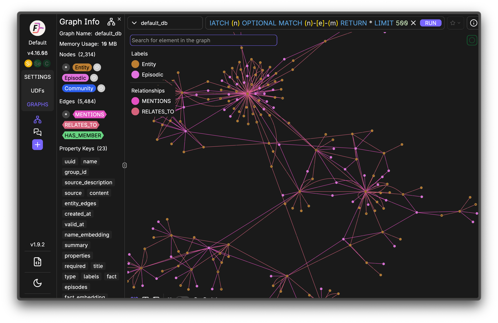

<p align="center">
  
  
  
  
</p>

# MemCore

**Memory that learns from how you use it.**

Every AI memory system today is a database you search. Store text, embed it, retrieve the closest match. MemCore is different — it's a living memory system modeled after how the human brain actually works. Memories strengthen when recalled. Unused knowledge fades. The system knows when it's confident and when it's guessing. Decisions persist forever while stale facts decay on a predictable curve. Memories enrich themselves with new context every time they're recalled.

MemCore scores quality *before* writing (epistemic write gate), tracks *how* memories are used (Ebbinghaus stability), tells the LLM *how much to trust* what it found (metamemory), forgets *what isn't needed* (per-type decay), enriches memories through use (reconsolidation), and remembers things *for the future* (prospective memory). Built for multi-agent systems where multiple AI sessions share a common memory across devices.

<p align="center">
  
  <br>
  <em>Knowledge graph built automatically from memories — 2,314 entities, 5,484 relationships</em>
</p>

---

## What Makes MemCore Different

| Capability | MemCore | MemPalace | OMEGA | AgentMemory | Mem0 |
|-----------|---------|-----------|-------|-------------|------|
| **Write gate** (score quality before storing) | Epistemic scoring (0-1) | None | None | None | None |
| **Metamemory** (confidence signal on recall) | FOK-inspired confidence levels | None | None | None | None |
| **Reconsolidation** (memories enrich on recall) | Prediction-error gated | None | None | None | None |
| **Prospective memory** (remember for the future) | Intent triggers | None | None | None | None |
| **Ebbinghaus stability** (access strengthens memory) | `S *= 1.3` per recall, per-type decay | None | Linear decay | Gaussian proximity | None |
| **Cross-encoder reranking** | ms-marco-MiniLM, 70/30 blend | None | ms-marco-MiniLM | ms-marco-MiniLM | None |
| **Knowledge graph** | Graphiti (FalkorDB) | None | None | SQLite graph | None |
| **Multi-agent** | Namespace routing, MCP, multi-device | Single session | Single session | Single session | Cloud API |
| **Fact extraction** | LLM atomic facts at write time | None | On write | Post-ingestion | On write |
| **Decision supersession** | Auto-detects + replaces old decisions | None | Conflict detection | Contradiction detection | None |

### Where We Stand (April 2026)

**90% end-to-end QA accuracy** on LongMemEval — the LLM must generate the correct answer, not just find the right document.

| System | LongMemEval | What It Actually Measures |
|--------|-------------|--------------------------|
| AgentMemory V4 | 96.2% QA | Best pure retrieval engine (6-signal fusion) |
| Chronos | 95.6% QA | Best temporal reasoning (SVO event calendar) |
| OMEGA | 95.4% QA | Best local-only system (SQLite + forgetting) |
| Mastra OM | 94.87% QA | Best no-retrieval approach (observation compression) |
| **MemCore** | **~90% QA** | **Only system with reconsolidation + prospective memory + bio-inspired lifecycle** |
| Mem0 | ~49% QA | Cloud-hosted vector search |

**Our thesis**: The storage and retrieval problem is largely solved. The remaining frontier is **memory lifecycle**: what to store, when to forget, how memories evolve, and how to know what you don't know.

---

## Quick Start

### 1. Clone and configure

```bash
git clone https://github.com/RyanWReid/memcore.git
cd memcore
cp .env.example .env
```

Edit `.env` with your LLM and embedding endpoints:

```bash
# Any OpenAI-compatible API works (LiteLLM, OpenRouter, direct API)
LITELLM_BASE_URL=http://localhost:4000/v1
LITELLM_API_KEY=your-api-key
GATE_MODEL=deepseek-chat

# Any OpenAI-compatible embeddings endpoint
EMBEDDING_URL=http://localhost:8100/v1/embeddings
EMBEDDING_MODEL=nomic-embed-text
```

### 2. Start the stack

```bash
docker compose up -d
curl http://localhost:8020/health
# {"status":"ok","service":"memcore","gate_threshold":0.55}
```

This starts MemCore + PostgreSQL (pgvector). No other dependencies required. Graphiti is optional for knowledge graph features.

### 3. Store a memory

```bash
curl -X POST http://localhost:8020/api/remember \
  -H "Content-Type: application/json" \
  -d '{"content": "Deployed CrowdSec on CT 100 with iptables bouncer. LAN subnets whitelisted.", "group_id": "homelab"}'
```

### 4. Recall with confidence

```bash
curl -X POST http://localhost:8020/api/recall \
  -H "Content-Type: application/json" \
  -d '{"query": "what IPS do we use", "group_id": "homelab", "limit": 5}'
```

Response includes metamemory confidence:
```json
{
  "results": [...],
  "count": 5,
  "confidence": {
    "level": "high",
    "signal": "Strong match, well-accessed, clear winner",
    "score": 0.92
  }
}
```

### 5. Store a prospective memory (intent)

```bash
curl -X POST http://localhost:8020/api/intent \
  -H "Content-Type: application/json" \
  -d '{"content": "Verify DNS resolution after restart", "trigger": "restarting Pi-hole or DNS issues"}'
```

Next time someone recalls anything about "Pi-hole restart" or "DNS issues", the intent surfaces first with `"prospective": true`.

---

## Claude Code Integration

MemCore is built for Claude Code. Two integration methods:

### Method 1: MCP Server (recommended)

Add to your `.mcp.json`:

```json
{
  "mcpServers": {
    "memcore": {
      "type": "sse",
      "url": "http://localhost:8020/sse"
    }
  }
}
```

This gives Claude Code 6 tools:
- **remember** — store through the epistemic write gate
- **recall** — fused search with confidence signal
- **forget** — mark a memory as deleted
- **audit** — inspect full details of any memory
- **intent** — store a prospective memory (remember for the future)
- **complete_intent** — mark an intent as done

### Method 2: Auto-Recall Hook (passive memory)

Create a Claude Code hook that automatically recalls relevant memories on every prompt — no manual tool calls needed.

**`.claude/hooks.json`:**

```json
{
  "hooks": [
    {
      "event": "UserPromptSubmit",
      "command": ".claude/hooks/memcore-recall.sh",
      "timeout": 5000
    }
  ]
}
```

**`.claude/hooks/memcore-recall.sh`:**

```bash
#!/bin/bash
set -e

INPUT=$(cat)
PROMPT=$(echo "$INPUT" | jq -r '.prompt // empty' 2>/dev/null)

# Skip short/trivial prompts
if [ -z "$PROMPT" ] || [ ${#PROMPT} -lt 10 ]; then
  exit 0
fi

LOWER=$(echo "$PROMPT" | tr '[:upper:]' '[:lower:]')
case "$LOWER" in
  "yes"|"no"|"ok"|"sure"|"do it"|"go ahead"|"thanks"|"continue"|"proceed")
    exit 0 ;;
esac

QUERY=$(echo "$PROMPT" | head -c 300 | tr -d '[]{}()' | tr '\n' ' ')

RESULT=$(curl -s --max-time 4 \
  -X POST "http://localhost:8020/api/recall" \
  -H "Content-Type: application/json" \
  -d "{\"query\": $(echo "$QUERY" | jq -Rs .), \"group_id\": \"homelab\", \"limit\": 5}" 2>/dev/null)

# Skip if weak confidence
CONFIDENCE=$(echo "$RESULT" | jq -r '.confidence.level // "unknown"' 2>/dev/null)
if [ "$CONFIDENCE" = "very_weak" ] || [ "$CONFIDENCE" = "no_memory" ]; then
  exit 0
fi

CONTEXT=$(echo "$RESULT" | jq -c '[(.results // [])[] | "- [\(.memory_type // "unknown")] \(.content | .[0:200])"] | join("\n")' 2>/dev/null)

if [ -z "$CONTEXT" ] || [ "$CONTEXT" = "null" ]; then
  exit 0
fi

CONTEXT=$(echo "$CONTEXT" | jq -r '.')

jq -n --arg ctx "$CONTEXT" '{
  "hookSpecificOutput": {
    "hookEventName": "UserPromptSubmit",
    "additionalContext": ("## MemCore Recalled Memories\nThese memories were auto-recalled based on the current prompt. Use them as context.\n\n" + $ctx)
  }
}'
```

Make it executable: `chmod +x .claude/hooks/memcore-recall.sh`

This hook fires on every prompt, searches MemCore, and injects relevant memories as additional context. The metamemory confidence signal filters out weak matches automatically.

### Both methods together

For best results, use both: the hook provides passive recall on every prompt, while the MCP tools let Claude actively store memories and set prospective intents.

---

## Architecture

```
WRITE PATH:
  Content --> Epistemic Write Gate (quality 0-1, type classification)
    |-- Score >= 0.55 --> Route by type:
    |     decisions/events --> Graphiti (temporal knowledge graph)
    |     facts/goals      --> PostgreSQL (pgvector + tsvector)
    |     + Fire-and-forget fact extraction (2-3 atomic facts per memory)
    |-- Score < 0.55 --> Rejected (with reason)
    |-- Duplicate check: cosine > 0.85 OR keyword overlap >= 3 --> Blocked

READ PATH:
  Query --> Expand (LLM synonyms)
        --> Check prospective intents (trigger matching)
        --> Hybrid search (pgvector cosine + tsvector keyword + RRF fusion)
        --> Cross-encoder rerank (ms-marco-MiniLM, 70/30 blend)
        --> Ebbinghaus retention scoring (per-type decay, stability growth)
        --> Fuse with Graphiti entity results (when graph contributes)
        --> Metamemory confidence signal (high/moderate/stale/weak)
        --> Fire-and-forget: access tracking + reconsolidation
        --> Return results + confidence + triggered intents to LLM

LIFECYCLE:
  Access tracking: Each recall increments access_count, grows stability
  Ebbinghaus decay: R = e^(-lambda * days / stability), per-type lambdas
  Reconsolidation: Prediction-error gated — enriches memories with new context
  Prospective memory: Intent triggers surface when conditions match
  Decision supersession: New decisions auto-replace old ones on same topic
```

---

## Bio-Inspired Design

Most AI memory systems borrow from information retrieval. MemCore borrows from neuroscience.

### Deployed

**Ebbinghaus Forgetting Curve** — `R = e^(-t/S)` where S grows by 1.3x per access. Per-type decay: decisions never fade, goals decay in 14 days, facts in 70. This is the biological spacing effect where practice makes durable.

**Metamemory (Feeling of Knowing)** — Returns confidence alongside results: `high`, `moderate`, `stale`, `weak`, `no_memory`. The LLM can answer directly on high confidence, caveat on stale, or abstain on weak.

**Epistemic Write Gate** — Quality scoring before storage. Evaluates factual confidence, future utility, semantic novelty, and content type before a memory enters the store.

**Reconsolidation** — When a memory is recalled in a genuinely new context (prediction error > 0.3), an LLM enriches it with additive information. Gated by access count, cooldown, and surprise detection to prevent drift.

**Prospective Memory** — The brain remembers to do things in the future. MemCore stores intents with trigger conditions that automatically surface when matching context appears during recall.

### Building Next

**Selective Replay** — Graph-guided consolidation. Well-connected entities get their scattered memories merged into rich summaries. Isolated memories decay naturally.

**Emotional Tagging** — High-arousal events (incidents, failures) create stronger traces that resist decay.

**Hebbian Co-Retrieval** — Memories recalled together develop association links, creating a usage-based graph.

---

## API Reference

### REST Endpoints

| Method | Path | Description |
|--------|------|-------------|
| GET | `/health` | Health check |
| POST | `/api/recall` | Search with confidence signal |
| POST | `/api/remember` | Store through write gate |
| POST | `/api/forget` | Mark memory as deleted |
| POST | `/api/intent` | Store prospective memory |
| POST | `/api/ingest` | Direct store (bypass gate) |
| POST | `/api/clear_group` | Delete all memories in a namespace |

### MCP Tools (via SSE at `/sse`)

| Tool | Description |
|------|-------------|
| `remember` | Store through epistemic write gate |
| `recall` | Fused search with confidence signal |
| `forget` | Mark a memory as deleted |
| `audit` | Inspect full memory details |
| `intent` | Store a prospective memory |
| `complete_intent` | Mark an intent as done |

---

## Configuration

All settings via environment variables (see `.env.example`):

| Variable | Default | Description |
|----------|---------|-------------|
| `LITELLM_BASE_URL` | `http://localhost:4000/v1` | LLM API endpoint |
| `LITELLM_API_KEY` | (empty) | API key for LLM |
| `GATE_MODEL` | `deepseek-chat` | Model for write gate scoring |
| `EMBEDDING_URL` | `http://localhost:8100/v1/embeddings` | Embedding endpoint |
| `EMBEDDING_MODEL` | `nomic-embed-text` | Embedding model name |
| `GATE_THRESHOLD` | `0.55` | Minimum score to store (0-1) |
| `RERANKER_ENABLED` | `true` | Cross-encoder reranking |
| `FACT_EXTRACTION_ENABLED` | `true` | Extract atomic facts on write |
| `RECONSOLIDATION_ENABLED` | `true` | Enrich memories on recall |
| `RECONSOLIDATION_MIN_ACCESS` | `3` | Min recalls before enrichment |
| `RECONSOLIDATION_COOLDOWN_HOURS` | `24` | Hours between enrichments |
| `GRAPHITI_URL` | `http://localhost:8000` | Graphiti (optional) |

---

## Stack

| Component | Technology | Purpose |
|-----------|-----------|---------|
| API | Python + Starlette + MCP SDK | REST + SSE endpoints |
| Storage | PostgreSQL 16 + pgvector | Hybrid vector + keyword search |
| Knowledge Graph | Graphiti + FalkorDB | Temporal entity relationships (optional) |
| Embeddings | nomic-embed-text (384d) | Local embedding server |
| Reranker | ms-marco-MiniLM-L-6-v2 | Cross-encoder on CPU (~50ms) |
| LLM | DeepSeek via LiteLLM | Write gate, fact extraction, query expansion |
| Containers | Docker Compose | PostgreSQL + MemCore app |

---

## Roadmap

### v5 -- Foundation (Complete)
- [x] Epistemic write gate with quality scoring
- [x] Hybrid search (pgvector + tsvector + RRF)
- [x] Cross-encoder reranking (ms-marco-MiniLM, 70/30 blend)
- [x] Write-time fact extraction (2-3 atomic facts per memory)
- [x] Decision supersession (auto-replaces outdated decisions)
- [x] Graphiti fused recall (postgres + graph merged)
- [x] Ebbinghaus stability tracking (access_count, stability growth)
- [x] Per-type decay lambdas (decisions permanent, goals 14d, facts 70d)
- [x] Metamemory confidence signal (high/moderate/stale/weak/no_memory)
- [x] Namespace routing (multi-tenant memory isolation)
- [x] MCP + REST dual API
- [x] Claude Code hooks (auto-recall on prompt)

### v6 -- Memory Lifecycle (In Progress)
- [x] Reconsolidation -- memories enrich on recall with new context
- [x] Prediction-error gating -- only reconsolidate when genuinely surprised
- [x] Prospective memory -- intent triggers surface when conditions match
- [ ] Arousal tagging -- conversation intensity scoring at write time
- [ ] Selective consolidation -- graph-guided merge of scattered memories
- [ ] Interference detection -- flag competing memories, return disambiguation signal

### v7 -- Self-Aware Memory
- [ ] Live truth verification -- cross-check memories against actual state
- [ ] Hebbian co-retrieval -- usage-based association links
- [ ] Adaptive retrieval weights -- learn per-signal weights from access patterns
- [ ] Abstention calibration -- metamemory tuned against actual accuracy

### Long-term Vision

The endgame isn't a better search engine. It's **memory that understands itself**: a system that knows what it knows, what it's forgotten, what's changed since it last checked, and what's probably wrong.

---

## Research

MemCore is built on competitive analysis of every system on the LongMemEval leaderboard and original research applying neuroscience principles to AI memory architecture.

Key references:
- [LongMemEval](https://github.com/xiaowu0162/longmemeval) -- ICLR 2025 benchmark
- [D-MEM: Dopamine-Gated Memory](https://arxiv.org/abs/2603.14597) -- prediction-error routing
- [Nemori: Self-Organizing Memory](https://arxiv.org/abs/2508.03341) -- free energy principle
- [Ebbinghaus (1885)](https://en.wikipedia.org/wiki/Forgetting_curve) -- forgetting curve
- [Nader et al. (2000)](https://www.nature.com/articles/35021052) -- memory reconsolidation

- [Research & development log](docs/research-log.md) -- session-by-session build history
